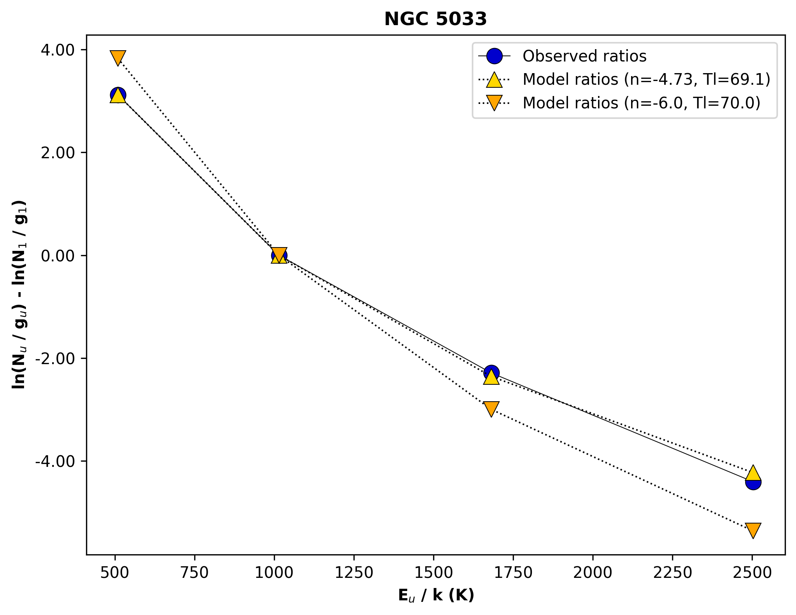

#########
Plotting
#########

``H2Powerlaw`` comes with a few convenient functions for generating basic H2 excitation plots for the observed line fluxes and for some power-law (PL) model.

These methods currently do not accept error bars as input; this is a priority in future development.

Observed Ratios
---------------

Assuming you have :doc:`already created <quickstart>` an ``H2Model`` object that we'll call ``p1``, you can visualize the column density ratios with...

.. code-block:: python
 
 f_ratio = p1.obs_ratio(p1.j_obs)
 p1.plot_obs_ratios(p1.j_obs, obs_ratio, ax = ax)

...where ``j_obs`` and ``f_ratio`` respectively contain the lower *J* values of the observed transitions and the normalized flux ratios for your target. ``plot_obs_ratios()`` returns a matplotlib Line2D object, which is then drawn on axis ``ax``. The curve and markers can be customized with the usual ``plt.plot()`` keywords. 

If you want to plot the excitation diagram with the x-axis (excitation temperature) in log scale, include ``xscale = log``.

Power-law Models
----------------

Similarly, you can visualize the column density ratios for a given PL model with a call to the method ``plot_mod_ratios``. This can be done from a particular ``H2Model`` object or directly from the ``H2Model`` class, meaning the two calls below are equivalent:

.. code-block:: python

 p1.plot_mod_ratios([0, 1, 2, 3], n = 6.0, Tl = 70., ax = ax)
 H2Model.plot_mod_ratios([0, 1, 2, 3], n = 6.0, Tl = 70., ax = ax)

Putting It Together
--------------------

To show a complete example of an ``H2Powerlaw`` plot, let's use the data and best-fit parameters we derived for NGC 5033 on the :doc:`quickstart` page. Just for fun, we'll also draw an excitation curve with a similar ``Tl`` but a much steeper PL slope.

.. code-block:: python

 fig, ax = plt.subplots()

 p1.plot_obs_ratios(p1.j_obs, norm_ratios, ax = ax,
   color = 'black', lw = 0.5, mfc = 'mediumblue', mec = 'black', mew = 0.5, ms = 10, marker = "o",  )
 p1.plot_mod_ratios(p1.j_obs, n = p1.slope, Tl = p1.Tl, ax = ax,
   color = 'black', lw = 1, ls = ":", mfc = 'gold', mec = 'black', mew = 0.5, ms = 10, marker = "^")
 p1.plot_mod_ratios(p1.j_obs, n = 6.0, Tl = 70., ax = ax,
   color = 'black', lw = 1, ls = ":", mfc = 'orange', mec = 'black', mew = 0.5, ms = 10, marker = "v")

 plt.show()

The result:

